---
## Author
author:
  name: Исупова Кристина Павловна
  degrees: DSc
  orcid: 0000-0002-0877-7063
  email: 1132250426@rudn.ru
  affiliation:
    - name: Российский университет дружбы народов
      country: Российская Федерация
      postal-code: 117198
      city: Москва
      address: ул. Миклухо-Маклая, д. 6
## Title
title: "Лабораторная работа №8"
subtitle: "дисциплина: Архитектура компьютеров"
license: "CC BY"
date: 03.04.2026
---

# Информация

## Докладчик

:::::::::::::: {.columns align=center}
::: {.column width="70%"}

  * Исупова Кристина Павловна
  * Студент НКАбд-05-25
  * я Кристина
  * Российский университет дружбы народов
  * [1132250426@pfur.ru](mailto:1132250426@pfur.ru)

:::
::: {.column width="30%"}

:::
::::::::::::::

---

# Цель работы

Ознакомление с инструментами поиска файлов и фильтрации текстовых данных. Приобретение практических навыков: по управлению процессами (и заданиями), по проверке использования диска и обслуживанию файловых систем.

---

# Задание

1. Осуществите вход в систему, используя соответствующее имя пользователя.
2. Запишите в файл file.txt названия файлов, содержащихся в каталоге /etc. Допишите в этот же файл названия файлов, содержащихся в вашем домашнем каталоге.
3. Выведите имена всех файлов из file.txt, имеющих расширение .conf, после чего запишите их в новый текстовой файл conf.txt.
4. Определите, какие файлы в вашем домашнем каталоге имеют имена, начинавшиеся с символа c? Предложите несколько вариантов, как это сделать.
5. Выведите на экран (по странично) имена файлов из каталога /etc, начинающиеся с символа h.
6. Запустите в фоновом режиме процесс, который будет записывать в файл ~/logfile файлы, имена которых начинаются с log.
7. Удалите файл ~/logfile.
8. Запустите из консоли в фоновом режиме редактор gedit.
9. Определите идентификатор процесса gedit, используя команду ps, конвейер и фильтр grep. Как ещё можно определить идентификатор процесса?
10. Прочтите справку (man) команды kill, после чего используйте её для завершения процесса gedit.
11. Выполните команды df и du, предварительно получив более подробную информацию об этих командах, с помощью команды man.
12. Воспользовавшись справкой команды find, выведите имена всех директорий, имеющихся в вашем домашнем каталоге.

---

# Теоретическое введение

В системе по умолчанию открыто три специальных потока:
- stdin — стандартный поток ввода (по умолчанию: клавиатура), файловый дескриптор 0;
- stdout — стандартный поток вывода (по умолчанию: консоль), файловый дескриптор 1;
- stderr — стандартный поток вывод сообщений об ошибках (по умолчанию: консоль), файловый дескриптор 2.
Большинство используемых в консоли команд и программ записывают результаты своей работы в стандартный поток вывода stdout. Например, команда ls выводит в стандартный поток вывода (консоль) список файлов в текущей директории. Потоки вывода и ввода можно перенаправлять на другие файлы или устройства. Проще всего это делается с помощью символов >, >>, <, <<. Конвейер (pipe) служит для объединения простых команд или утилит в цепочки, в которых результат работы предыдущей команды передаётся последующей. Команда find используется для поиска и отображения на экран имён файлов, соответствующих заданной строке символов.

---

# Выполнение лабораторной работы

1. Записываю в файл file.txt названия файлов, содержащихся в каталоге /etc (рис. [-@fig:001]).

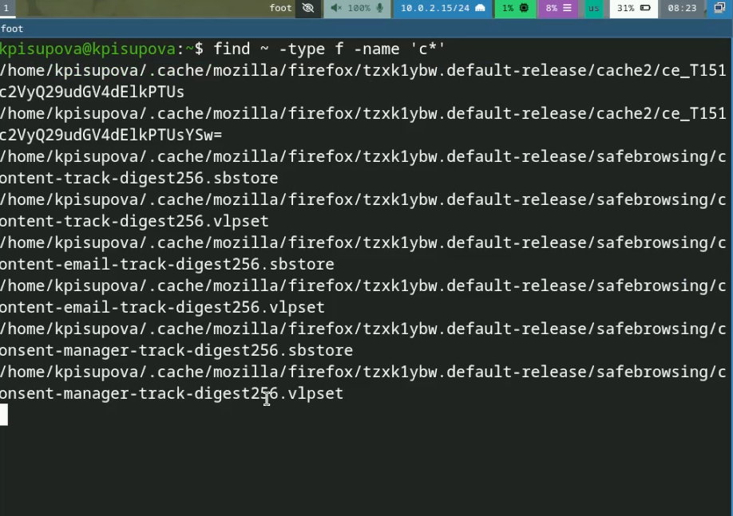{#fig:005 width=70%}

---

{#fig:006 width=70%}

---

4. Вывожу на экран имена файлов из каталога /etc, начинающиеся с символа h (рис. [-@fig:007]).

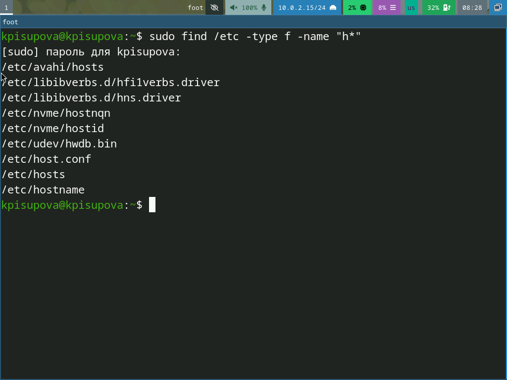{#fig:007 width=70%}

---

5. Запускаю в фоновом режиме процесс, который будет записывать в файл ~/logfile.txt файлы, имена которых начинаются с log (рис. [-@fig:008]).

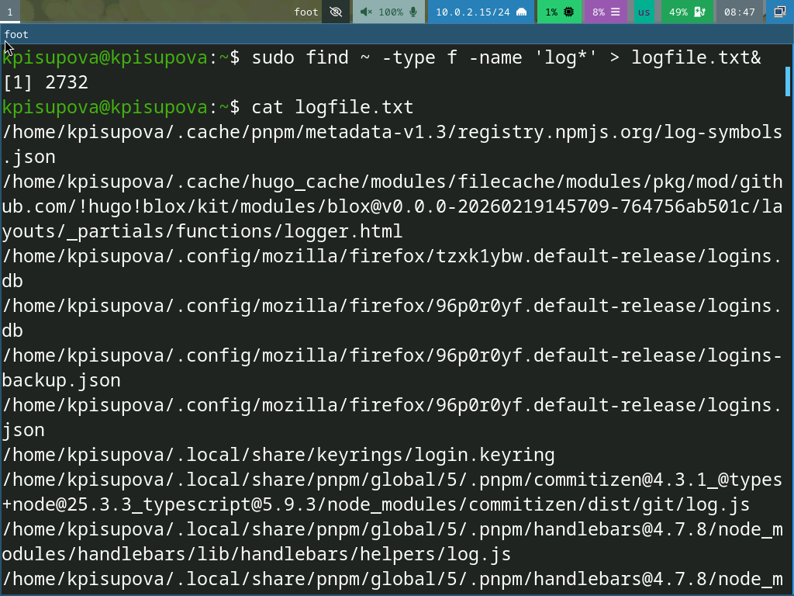{#fig:008 width=70%}

---

6. Удаляю файл ~/logfile.txt (рис. [-@fig:009]).

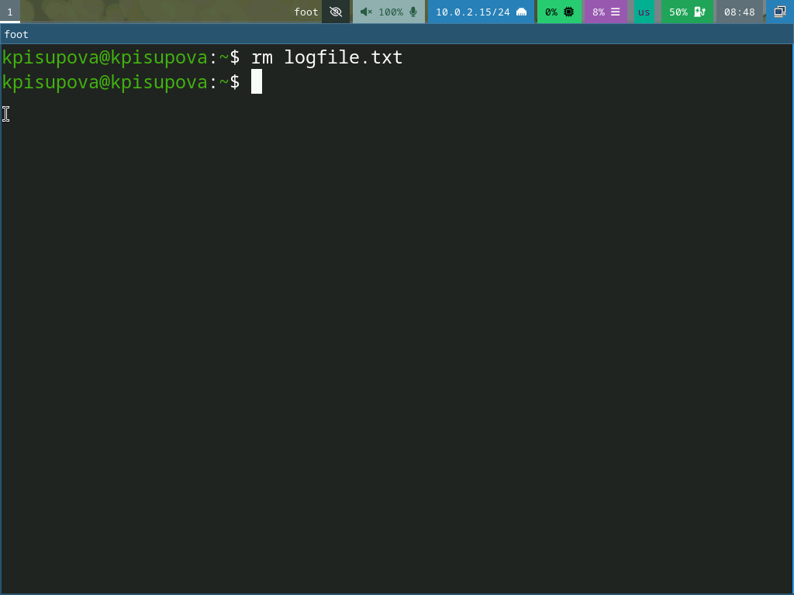{#fig:009 width=70%}

---

7. Запускаю из консоли в фоновом режиме редактор gedit. Определяю идентификатор процесса gedit, используя команду ps, конвейер и фильтр grep (рис. [-@fig:010]). Прочитав справку (man) команды kill (рис. [-@fig:011]), использую её для завершения процесса gedit

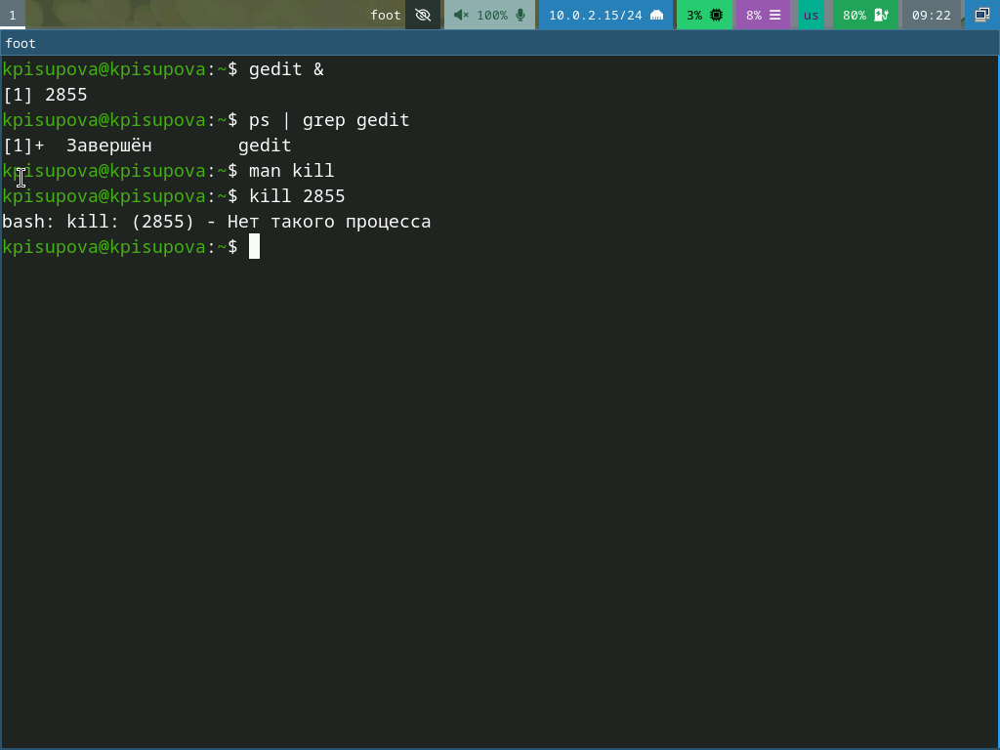{#fig:010 width=70%}

---

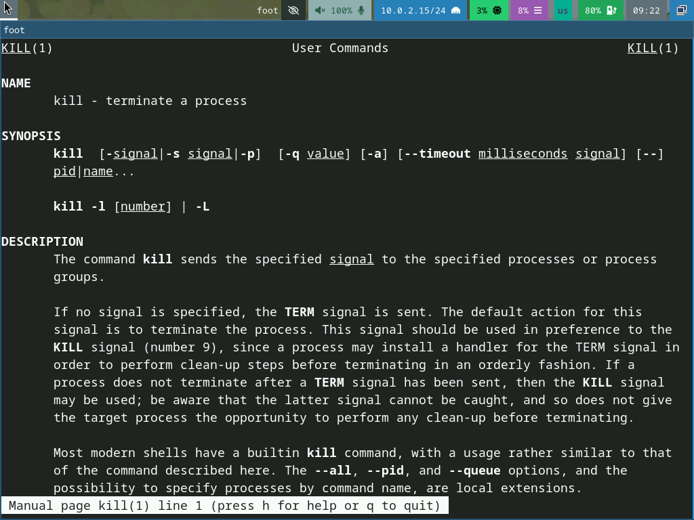{#fig:011 width=70%}

---

8. Получаю подробную информацию о командах df (рис. [-@fig:012]) и du (рис. [-@fig:013]).

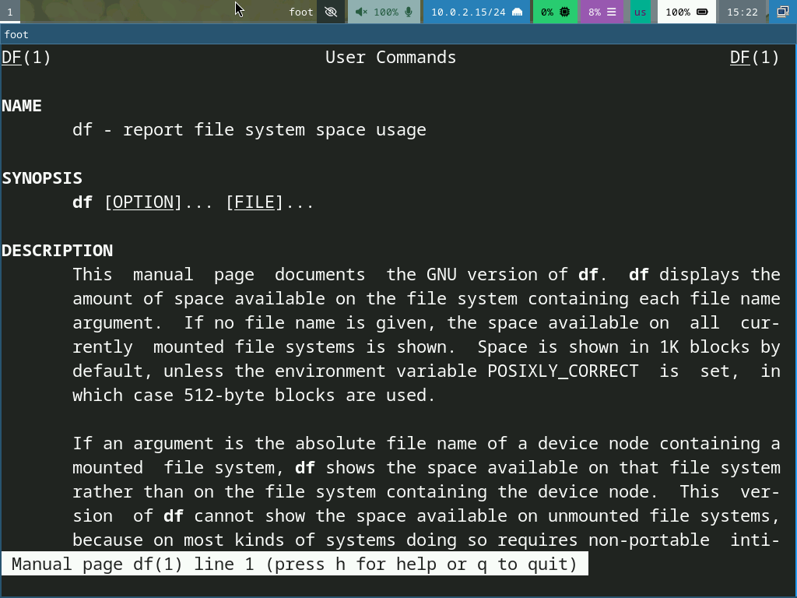{#fig:012 width=70%}

---

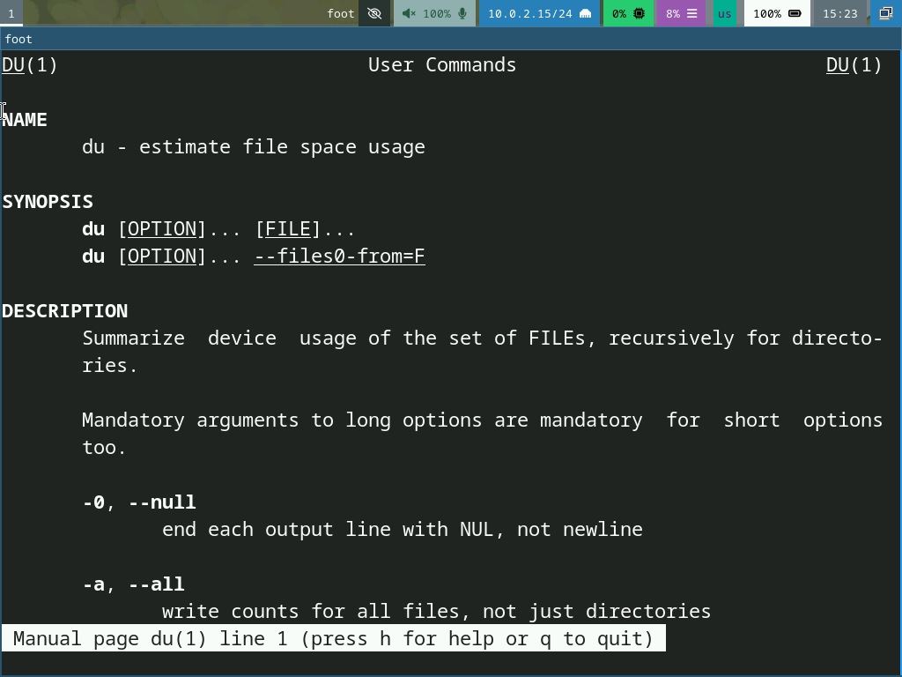{#fig:013 width=70%}

---

Выполняю команду df (рис. [-@fig:014]).

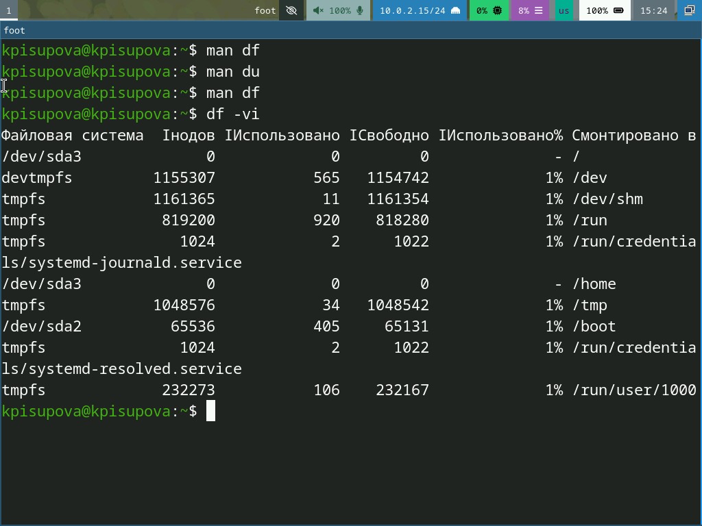{#fig:014 width=70%}

---

Выполняю команду du (рис. [-@fig:015]).

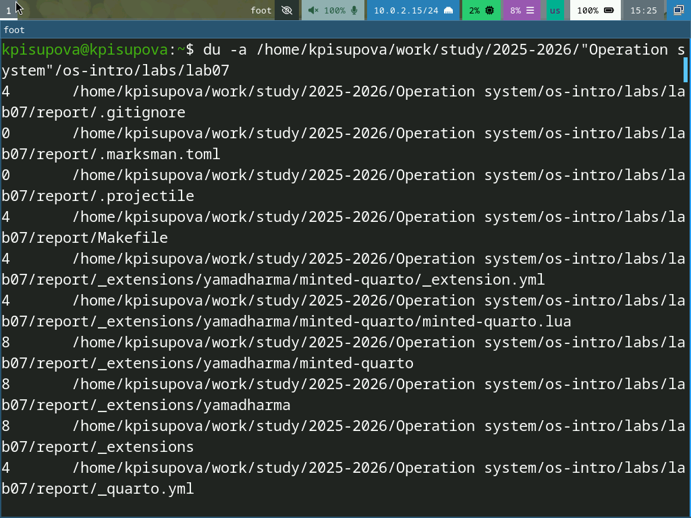{#fig:015 width=70%}

---

9. Воспользовавшись справкой команды find (рис. [-@fig:016]), вывожу имена всех директорий, имеющихся в моём домашнем каталоге (рис. [-@fig:017]).

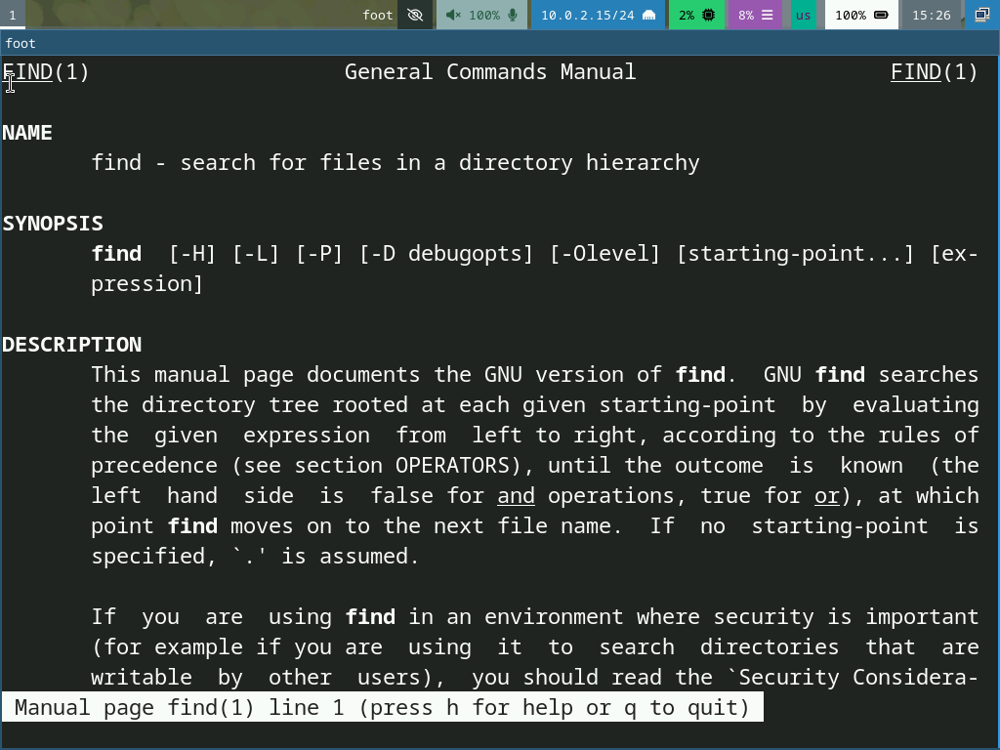{#fig:016 width=70%}

---

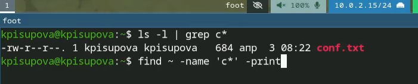{#fig:017 width=70%}

---

# Выводы

В ходе выполнения лабораторной работы я ознакомилась с инструментами поиска файлов и фильтрации текстовых данных. Приобрела практические навыки: по управлению процессами (и заданиями), по
проверке использования диска и обслуживанию файловых систем.
:::
